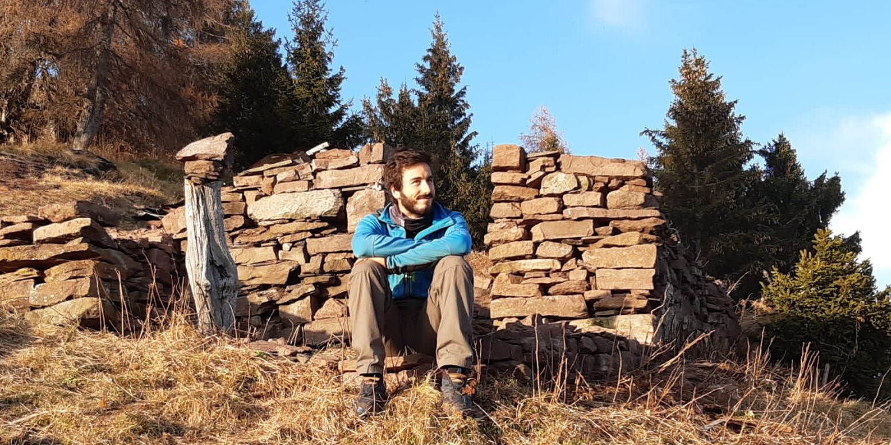

# Martino Zanetti

**University of Vienna**, Physics department
**Max Perutz Labs**, Campus-Vienna-Biocenter 5  
[martino.zanetti@gmail.com](mailto:martino.zanetti@gmail.com)  
[martino.zanetti@univie.ac.at](mailto:martino.zanetti@univie.ac.at)
  
I am a PhD student at the University of Vienna and I am currently working on [Quantum-Computer-Enhanced Electron Microscopy](www.qcem.info) in collaboration with TUWien, the University of Innsbruck and the Johannes-Kepler University of Linz. I am also supervising a project on electron wavefront shaping with light in free space, using a modified Scanning Electron Microscope. 

Other fields of interest are electronics, laser physics, computer programming and processes automation, environmental and climate physics and energy supply issues.
As a practical person, I enjoy understanding and using laboratory equipment and I always try to get better with know-how and DIY skills.
In my time out of work I enjoy spending time with friend in the nature, hiking, climbing, cycling, travelling and so on. I try my best to engage in activism in support of climate justice, feminism, end of wars, freedom and self determination of peoples.

If you want to know more, please visit [this page](https://martinozanetti.github.io/aboutme/).
